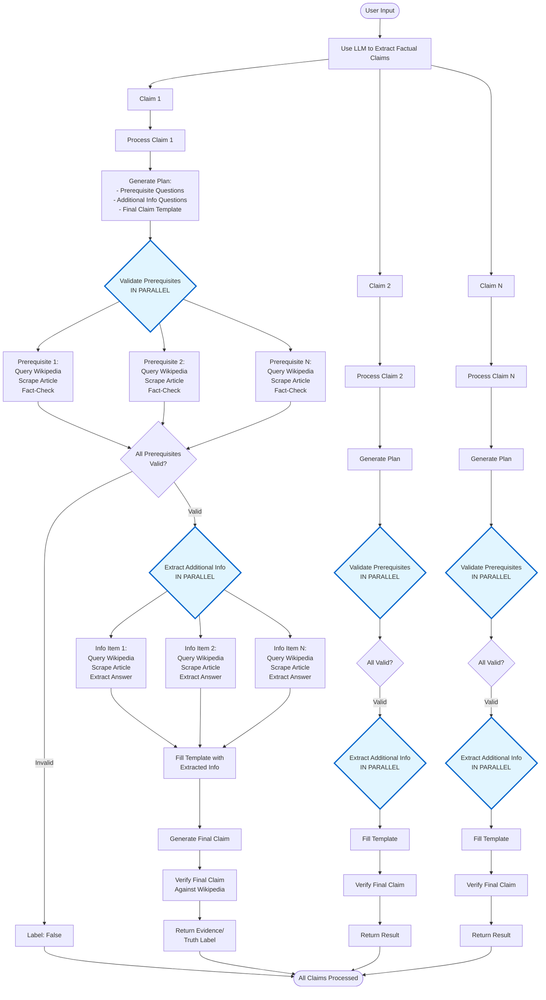

# Truth Machine Flow Diagram

## Key Parallelization Points

1. **Prerequisite Validation (Parallel)**: All prerequisite questions for a claim are validated simultaneously. Each prerequisite independently:
   - Queries Wikipedia for relevant article
   - Scrapes article content
   - Fact-checks the prerequisite against the article
   - Returns validation result

2. **Additional Information Extraction (Parallel)**: All additional information questions for a claim are processed simultaneously. Each information item independently:
   - Queries Wikipedia for relevant article
   - Scrapes article content
   - Extracts the answer from the article
   - Returns extracted information

3. **Sequential Dependencies**: 
   - Plan generation must complete before prerequisites and additional info can be processed
   - Prerequisites must all be valid before additional info extraction begins
   - Final claim generation depends on all additional info being extracted
   - Final validation depends on final claim generation

