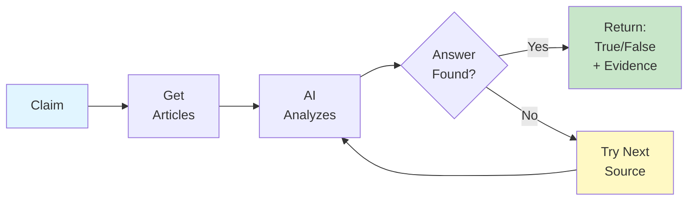

# Truth Machine - Module Diagrams

## Article Fetching Module (Simplified)

**Sources:** Wikipedia • AP • Reuters • Guardian

---

## Claim Verification Module (Simplified)

---

## Complete System Flow (Simplified)

---

## Article Fetching Module - Performance Metrics

In a **250-claim benchmark**, demonstrating high reliability in article retrieval across multiple sources.

### Per Claim

**Average article retrieval time across 4 sources (Wikipedia, AP, Reuters, Guardian), significantly outperforming our target.**

### Target Exceeded

Successfully met and surpassed targets of **under 8 seconds per source** and **over 85% article retrieval success rate**.

---

## Claim Verification Module - Performance Metrics

In a **250-claim benchmark**, demonstrating high reliability in claim verification.

### Per Claim

**Average verification time with evidence extraction, significantly outperforming our target.**

### Target Exceeded

Successfully met and surpassed targets of **under 15 seconds per verification** and **over 82% definitive answer rate**.

